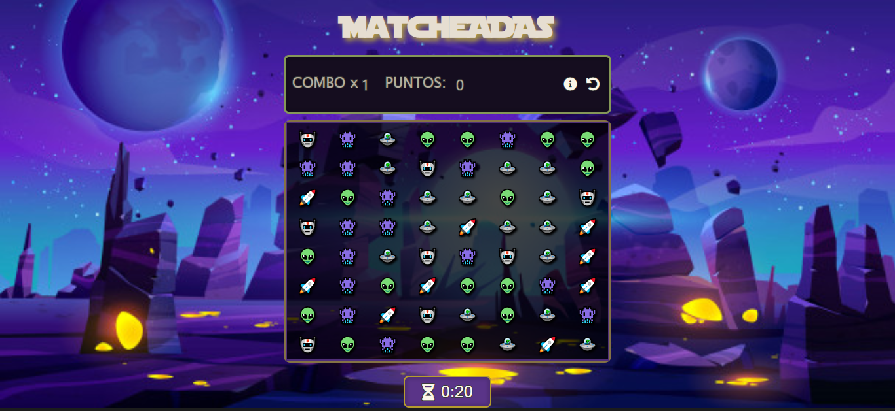

# 🤖Juego MatcheADAs by: Raquel Muriega 🤖

### En este juego podrás disfrutar y jugar las veces que desees 🎮 Su  objetivo es lograr encontrar coincidencia de 3 o mas items iguales para acumular puntos en un periodo de tiempo determinado. 

#### Este Proyecto fue realizado como evaluacion final del modulo del curso de desarrollo FrontEnd Ada, utilizando HTML, CSS y JavaScript.
<br>


### 📌No pierdas más tiempo! Si quieres JUGARLO hace click [acá](https://reymga.github.io/Proyecto-matcheADAs/)

<br>

***

# Pasos para la instalación 👀 👇


 - Ir al [repositorio](https://github.com/ReyMga/Proyecto-matcheADAs)


 - Dale click al botón de forkear 


 - Darle click al botón de code

 - Copia la URL

 - Abrir tu terminal y poner el comando de 
 ``` git clone  <url> ```

 - Entrar a la carpeta del proyecto y abrirlo en tu IDE
<br>
***

## Esta página fue construida con 🛠️

#### [HTML]
#### [CSS]
#### [JAVASCRIPT]

***
# Expresiones de Gratitud 🎁

### Este proyecto se hizo posible gracias a la  ayuda y  guía de nuestros profes [Jonhks](https://github.com/Jonhks) & [Leydy](https://github.com/leydyk93/)

<br>

***

### De Raquel 🖤🧡